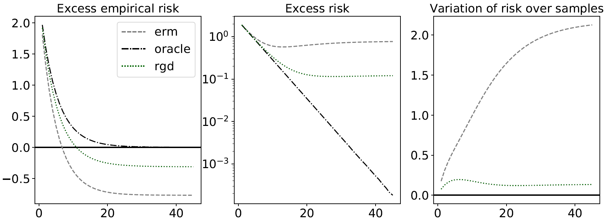

# rgd: Robust gradient descent examples

In this repository, we provide example code to accompany the following paper:

 - <a href="http://proceedings.mlr.press/v97/holland19a.html">Better generalization with less data using robust gradient descent</a>. Matthew J. Holland and Kazushi Ikeda. ICML 2019.


## Running the demo

This demo has been tested using Python 3.6 and NumPy 1.16, using the following virtual environment managed using `conda` (of course, `conda` is by no means required). Assuming the user has `conda` installed, run the following to get set up.

```
$ conda update -n base conda
$ conda create -n rgd python=3.6 numpy matplotlib
```

The current example we have ready and working is called "POC" (proof of concept). This corresponds to the graphs in Figure 1 of our ICML paper. The first figure is for Normal noise, the second is for log-Normal noise. See the paper for experimental details.

```
$ conda activate rgd
(rgd) $ ./learn_POC.sh lognormal
(rgd) $ ./learn_POC.sh normal
```

The above code generates two PDF figures in a directory called `img`. Since the inputs, the noise, and the weights are all initialized randomly, the results will vary slightly each time, but since we are averaging over a large number of trials, the results are fairly stable. Here is the kind of result to expect:

- Normal case:
 

- log-Normal case:
 


__Author and maintainer:__<br>
<a href="https://feedbackward.com/">Matthew J. Holland</a> (Osaka University, ISIR)

